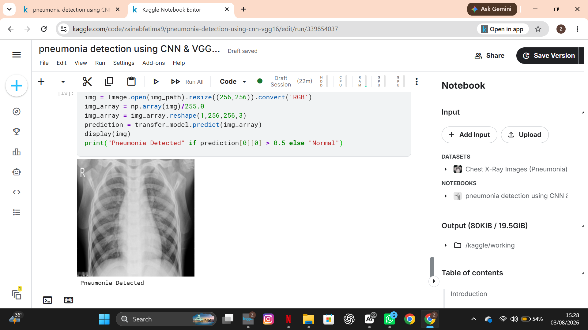
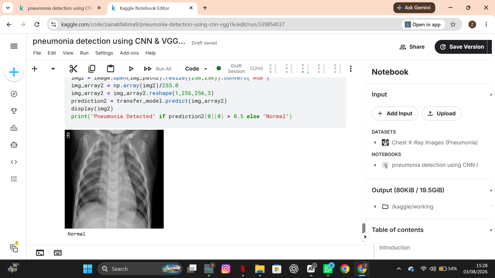
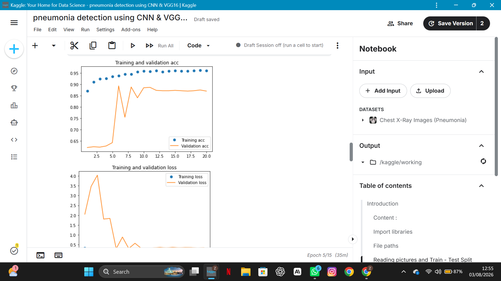
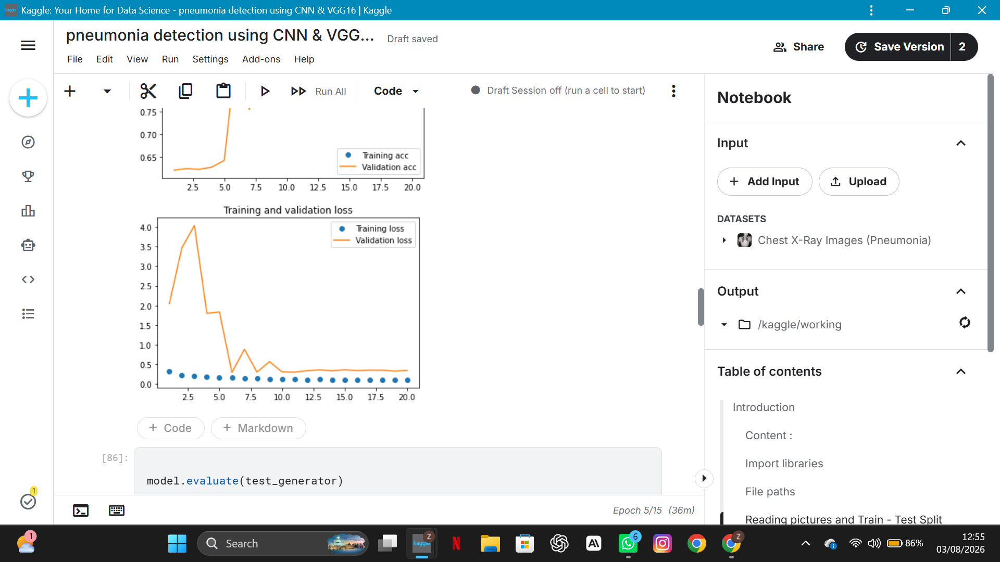
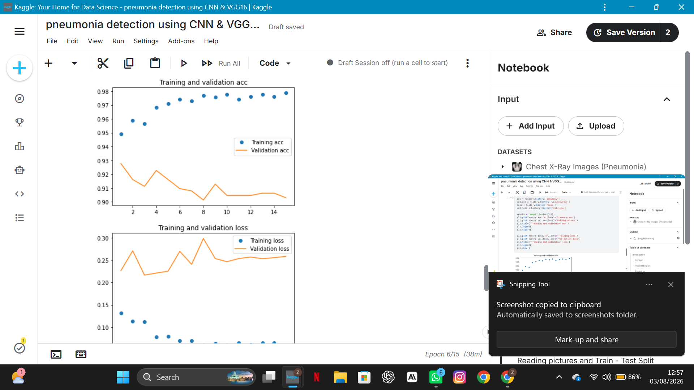
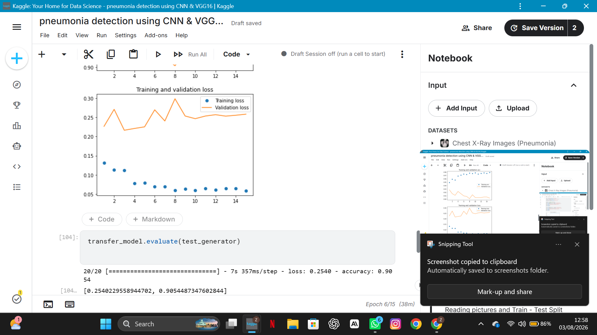
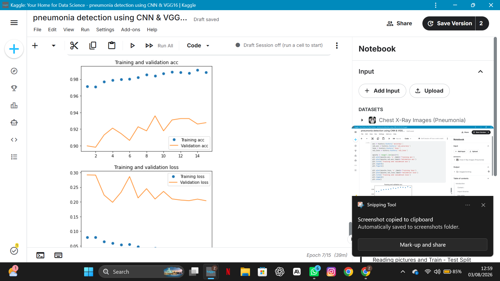
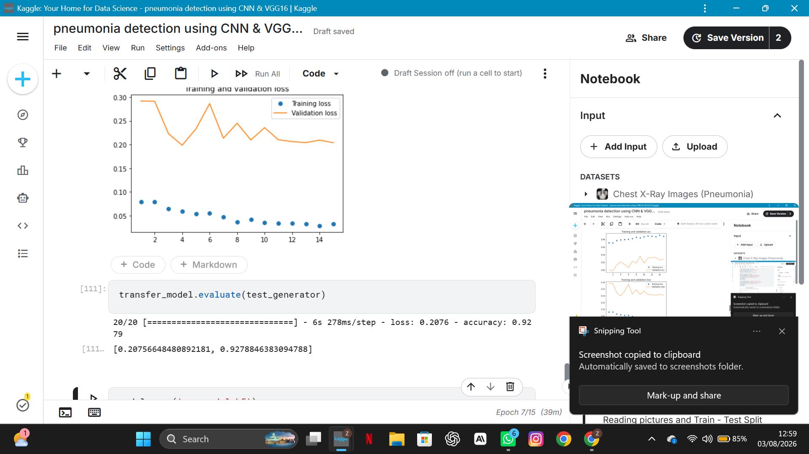
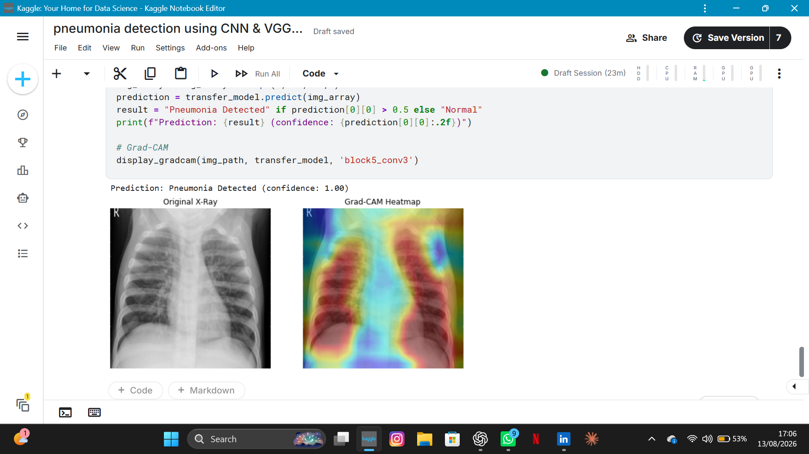

# 🫁 AI-Assisted Pneumonia Triage from Chest X-Rays


> A prototype tool that flags chest X-rays showing signs consistent with pneumonia and helps prioritize which scans a radiologist reviews first — built by a Medical Imaging Technology student to explore how AI can support imaging workflows, not replace radiologist interpretation.

**[🚀 Live App](#live-demo)** · **[📊 Results](#results)** · **[🧠 Grad-CAM](#model-interpretability-grad-cam)** · **[🖥️ App Walkthrough](#app-walkthrough)** · **[⚙️ Run Locally](#run-locally)**

🤗 [**Custom CNN model**](https://huggingface.co/zainabfatima9/pnemonia-cnn-model) · 🤗 [**VGG16 model**](https://huggingface.co/zainabfatima9/pneumonia-vgg16-model) · 💻 [**Source code**](https://github.com/Zainabfaima9/pneumonia-detection-cnn-app)

---

## Table of Contents

1. [Why This Project](#why-this-project)
2. [Public Health Context](#public-health-context)
3. [What It Does](#what-it-does)
4. [App Walkthrough](#app-walkthrough)
5. [Dataset](#dataset)
6. [Methodology](#methodology)
7. [Results](#results)
8. [Model Interpretability (Grad-CAM)](#model-interpretability-grad-cam)
9. [Live Demo](#live-demo)
10. [Run Locally](#run-locally)
11. [From Prototype to Practice](#from-prototype-to-practice)
12. [Challenges Along the Way](#challenges-along-the-way)
13. [Limitations](#limitations)
14. [A Note on Process](#a-note-on-process)
15. [Tech Stack](#tech-stack)
16. [License](#license)
17. [Responsible Use & Disclaimer](#responsible-use--disclaimer)
18. [Project Links](#project-links)
19. [Author](#author)

---

## Why This Project

I'm a Medical Imaging Technologist, not a radiologist — and that distinction is the actual starting point of this project. Technologists don't diagnose. We capture images and manage the workflow that decides how fast a patient's scan gets seen. In many settings, that workflow is the real bottleneck: a scan can be technically perfect and still sit in a queue if there aren't enough specialists to read it in time.

That's the gap I wanted to explore, hands-on: not *"can AI diagnose pneumonia,"* but **can AI help prioritize which X-rays need a radiologist's eyes first?** So I taught myself the core deep learning workflow, built and compared two models, added interpretability so predictions aren't a black box, and deployed both as a live multi-page web app that simulates what a triage-assisted reading workflow could look like.

This project is also a marker of the direction I want to take my career — staying rooted in imaging technology while building the technical fluency to design AI tools that actually fit into how imaging departments work, not just tools that score well on a test set.

---

## Public Health Context

Pneumonia isn't a rare or abstract disease — it's one of the world's leading causes of death, and the framing behind why triage speed matters at all:

| | |
|---|---|
| 🌍 **Global cases per year** | ~450 million (roughly 7% of the world's population) |
| ⚰️ **Global deaths per year** | ~4 million |
| 🧒 **Child deaths under 5 (2021)** | 500,000+ — the leading infectious killer of children worldwide |
| 🇵🇰 **Pakistan** | Repeatedly ranked by WHO, UNICEF, and Global Burden of Disease estimates among the countries with the highest child pneumonia death tolls globally, alongside India, Nigeria, and the DR Congo |

*(Figures are approximate, drawn from publicly available WHO/UNICEF/GBD reporting; exact numbers vary by year and source.)*

Pneumonia can move from mild to life-threatening within hours, especially in young children and elderly patients. Early diagnosis directly changes outcomes — earlier antibiotics, earlier oxygen support, fewer complications. That urgency is exactly why *triage speed*, not just detection accuracy, is the problem this project focuses on.

---

## What It Does

Upload a chest X-ray → both models flag it as **Normal** or **showing signs consistent with Pneumonia**, in real time, alongside a Grad-CAM heatmap — all in one view, framed as a triage aid, not a diagnosis.

**Workflow:** `Upload X-ray → Preprocessing → Dual Inference (CNN + VGG16) → Grad-CAM → Prediction + Priority Signal`

| | |
|---|---|
| 🖼️ **Input** | Chest X-ray image (JPEG/PNG), uploaded or chosen from built-in samples |
| 🧠 **Models** | Custom CNN **and** VGG16 (Transfer Learning) — run and compared side by side |
| 👁️ **Interpretability** | Grad-CAM heatmap generated in the same step as the prediction |
| 📋 **Triage simulation** | Batch upload reordered into a prioritized reading queue by urgency |
| 🌐 **Deployment** | Streamlit Cloud, live and public |

---

## App Walkthrough

The app is organized as five pages:

- **Home** — project introduction and the public health context above
- **Diagnose an X-ray** — upload an image or pick a built-in sample; see the Custom CNN and VGG16 predictions *and* the Grad-CAM heatmap together in a single result, including a flag when the two models disagree
- **Model Comparison** — accuracy comparison and an explanation of why VGG16 (transfer learning) is the stronger, recommended model
- **Triage Queue Simulator** — upload a batch of X-rays (or use the built-in demo set) and watch them reordered into a prioritized reading queue, most urgent first
- **Future Vision** — where this prototype would need to go to become a real clinical tool

*(See [Results](#results) below for screenshots of the app's predictions in action.)*

---

## Dataset

- **Source:** [Chest X-Ray Images (Pneumonia) — Kaggle](https://www.kaggle.com/datasets/paultimothymooney/chest-xray-pneumonia), originally collected from pediatric patients (ages 1–5) at Guangzhou Women and Children's Medical Center
- **Total size:** 5,863 labeled chest X-ray images (JPEG), split into train / validation / test folders
- **Class split:**

  | Split | Normal | Pneumonia | Total |
  |---|---|---|---|
  | Train | 1,341 | 3,875 | 5,216 |
  | Validation | 8 | 8 | 16 |
  | Test | 234 | 390 | 624 |

- **Class imbalance:** The training set is roughly 1:3 (Normal:Pneumonia) — a real-world imbalance worth flagging, since it can bias a model toward over-predicting the majority class if not accounted for
- **Preprocessing:** Resizing (128×128 grayscale for the CNN, 256×256 RGB for VGG16), pixel normalization, binary labels (Normal / Pneumonia)

---

## Methodology

Two models were built and compared, to see how a model trained from scratch stacks up against transfer learning on a limited medical imaging dataset:

1. **Custom CNN** — a convolutional network designed and trained from the ground up, taking 128×128 grayscale input
2. **VGG16 (Transfer Learning)** — a network pretrained on ImageNet, with its convolutional base reused and a new classification head fine-tuned on the chest X-ray dataset, taking 256×256 RGB input

Both models end in a single sigmoid output — framing this as a binary classification problem (Normal vs. Pneumonia) trained with binary cross-entropy loss — and were trained for 15 epochs on an 80/20 train-test split, then evaluated on a held-out test set.

---

## Results

| Model | Test Accuracy | Input |
|---|---|---|
| Custom CNN | **89%** | 128×128 grayscale |
| VGG16 (Transfer Learning) | **92%** ✅ | 256×256 RGB |

VGG16 came out ahead — and that gap is the interesting part, not just the numbers. It's a clear, hands-on demonstration of *why* transfer learning matters for medical imaging: the pretrained network arrived already knowing how to recognize general visual patterns, so it needed far less data to specialize in X-rays than a model starting from zero. In the app, VGG16 is presented as the recommended model for real deployment, with the CNN kept as a lightweight, interpretable baseline.

> **Next step:** precision, recall, F1-score, and a confusion matrix would give a fuller picture than accuracy alone — especially since missed pneumonia cases (false negatives) matter more clinically than false alarms, and the training set's 1:3 class imbalance makes accuracy alone an incomplete metric. This is a planned addition (see [Future Vision](#from-prototype-to-practice)).

### Sample Predictions

The app flags each X-ray as Normal or showing signs consistent with Pneumonia:




### Training Curves

Training and validation accuracy/loss curves recorded across epochs for both models:








---

## Model Interpretability (Grad-CAM)

A high accuracy score means nothing to a clinician if they can't see *why* the model made a call — and for a tool meant to support a real imaging workflow, that trust gap is the whole problem, not a footnote. So I applied **Grad-CAM (Gradient-weighted Class Activation Mapping)** to visualize which regions of each X-ray most influenced the model's prediction, generated live alongside every prediction in the app.



On the pneumonia-flagged X-ray above, the heatmap concentrates on the lower lung fields — the anatomical region where pneumonia-related opacity typically appears — rather than on bone, soft tissue, or image edges. That's not proof the model is clinically reliable, but it is evidence it's attending to plausible regions rather than shortcuts in the image, which is the minimum a technologist or radiologist would need to see before trusting a flag like this at all.

---

## Live Demo

**[Try it yourself → pneumonia-detection-cnn-app-a4j2vpt7bpfvfqzupxdjwn.streamlit.app](https://pneumonia-detection-cnn-app-a4j2vpt7bpfvfqzupxdjwn.streamlit.app/)**

Upload any chest X-ray, or pick a built-in sample, and see both models' predictions plus a Grad-CAM heatmap instantly. Both trained models are hosted on Hugging Face Hub and loaded dynamically by the app, due to file size constraints on GitHub.

---

## Run Locally

```bash
# Clone the repository
git clone https://github.com/Zainabfaima9/pneumonia-detection-cnn-app.git
cd pneumonia-detection-cnn-app

# Install dependencies
pip install -r requirements.txt

# Run the app
streamlit run app.py
```

The app will open at `http://localhost:8501`. Model weights are downloaded automatically from Hugging Face Hub on first run.

---

## From Prototype to Practice

Building the models was the easy part. Turning this into something an imaging department could actually trust and use is a different problem entirely — and it's the problem I'm more interested in than the model itself:

- **Workflow integration:** Connect directly to a hospital's PACS/RIS system so flagged X-rays are automatically bumped up in the radiologist's reading list, instead of requiring a separate app.
- **Multi-class detection:** Extend beyond Normal vs. Pneumonia to distinguish bacterial vs. viral pneumonia, and flag other common findings (e.g. pleural effusion, TB-suggestive patterns), since these change treatment decisions.
- **Severity scoring:** Move from a binary flag to a severity score, so radiologists see not just "pneumonia present" but a rough sense of how urgent the case is.
- **Larger, multi-site validation:** Test and retrain on X-rays from multiple hospitals, scanner types, and patient populations — this prototype has only seen one relatively small, single-source dataset.
- **Edge deployment:** A lightweight version that can run on modest hardware in clinics without a radiologist on-site, where triage delay is often the biggest problem.
- **Regulatory pathway:** Any tool that touches real patient care — even a triage aid, not a diagnostic one — needs to go through proper medical device regulation (e.g. FDA, CE marking) before real-world use.
- **Combined imaging dashboard:** Pair this with other imaging AI tools (such as a CT image-quality/dose-optimization tool) into a single department-wide triage and quality dashboard, rather than a standalone app.

This is the layer I want to spend my career working in: not just building models, but understanding how a promising prototype like this one actually becomes a tool a hospital would adopt.

---

## Limitations

- Trained on a relatively small dataset (~5,800 images) from a single source
- No demographic diversity metadata available
- Not validated against real clinical outcomes
- Flags signs *consistent with* pneumonia — it does not diagnose severity, type (bacterial vs. viral), or any other condition
- Grad-CAM is currently available for the Custom CNN only, not yet for VGG16
- Built for education and demonstration — not for actual clinical use

---

## A Note on Process

This project started from a publicly available Kaggle tutorial notebook, which I used to learn the core workflow of building and training a CNN for image classification. From there, I adjusted the training setup, evaluated both models independently, added Grad-CAM interpretability, built out the multi-page triage app, wrote my own analysis, and deployed the final result as a live tool. I think being upfront about that starting point — rather than pretending it began from a blank file — is part of doing this honestly.

---

## Tech Stack

`Python` · `TensorFlow / Keras` · `Kaggle Notebooks (GPU)` · `Streamlit` · `Hugging Face Hub (model hosting)` · `Grad-CAM` · `Matplotlib` · `GitHub`

---

## Challenges Along the Way

This project didn't come together in a straight line, and I think that's worth documenting honestly rather than smoothing over:

- **Input shape mismatches:** Early on, I assumed VGG16 needed the standard 224×224 input size. When I connected it to the live app, deployment failed with a shape error (`expected shape=(None, 256, 256, 3), found shape=(None, 224, 224, 3)`) — the model was actually trained on 256×256 images. It was a reminder that preprocessing in a deployed app has to match training exactly, not just follow a textbook default.
- **Large model files vs GitHub's limits:** The Custom CNN was small enough to deploy without much trouble, but VGG16 — being a much deeper, pretrained network — produced a far larger model file that GitHub couldn't accept directly and that took noticeably longer to load. I ended up hosting both models on Hugging Face Hub and loading them dynamically at runtime with `huggingface_hub`, which kept the repository lightweight and made deployment reliable. This wasn't just a packaging inconvenience — it's a real, recurring trade-off in medical imaging AI: a more accurate model is often a heavier one, and any tool meant for a busy clinical setting (or a low-resource clinic with limited hardware, as discussed in [Future Vision](#from-prototype-to-practice)) has to weigh accuracy against deployability, not just chase the highest test score.
- **A subtle Streamlit bug:** After adding the dual-model comparison, the app started printing raw internal Streamlit objects (a `DeltaGenerator` and its full docstring) onto the page instead of a clean result. The cause was a one-line `st.error(...) if condition else st.success(...)` written as a standalone statement — Streamlit's "magic" auto-display feature was treating that expression's return value as something to render. Rewriting it as an explicit `if/else` block fixed it. A small bug, but a good lesson in how Streamlit's implicit behavior can surprise you.
- **Model format differences:** The CNN was saved as `.h5` and VGG16 as `.keras` — Keras' two supported save formats — which meant double-checking that both loaded correctly through the same `tf.keras.models.load_model()` call.
- **Deprecation warnings:** Streamlit flagged `use_container_width` as deprecated mid-project, which meant updating image-display calls to the newer `width="stretch"` parameter to keep the app future-proof.

None of these were dramatic failures, but they were the kind of small, real debugging moments that don't show up in a tutorial — and they taught me more about actually shipping a model than the training step did.

---

## License

This project is licensed under the [MIT License](LICENSE) — free to use, modify, and share with attribution.

---

## Responsible Use & Disclaimer

This project is intended for **educational, research, and demonstration purposes only**.

The tool flags signs *consistent with* pneumonia to support prioritization of radiologist review — it does **not** diagnose disease and is **not intended to replace radiologists, radiographers, or other qualified healthcare professionals**. Any decision regarding diagnosis, image acceptability, or clinical action must remain under appropriate professional oversight.

Before any real-world clinical use, a system like this would require independent external validation, multi-site testing, clinical workflow evaluation, and applicable medical device regulatory review (e.g. FDA, CE marking).

> **AI should support professional judgment — not replace it.**

---

## Project Links

- 🌐 [Live Streamlit App](https://pneumonia-detection-cnn-app-a4j2vpt7bpfvfqzupxdjwn.streamlit.app/)
- 🤗 [Custom CNN Model — Hugging Face](https://huggingface.co/zainabfatima9/pnemonia-cnn-model)
- 🤗 [VGG16 Model — Hugging Face](https://huggingface.co/zainabfatima9/pneumonia-vgg16-model)
- 💻 [Source Code — GitHub](https://github.com/Zainabfaima9/pneumonia-detection-cnn-app)

---

## Author

**Zainab Fatima**
BS Medical Imaging Technology — 7th semester

I'm currently in my final year of a BS in Medical Imaging Technology, and this project sits at the intersection of the two things I want my career to be built on: hands-on clinical imaging experience, and the technical skill to build AI tools that actually fit into how imaging departments work. I'm applying for opportunities to continue this work at a graduate level, and this project — bugs, rewrites, and all — is my way of showing that process rather than just the polished result.

*[Add your email / LinkedIn / GitHub profile link here]*
